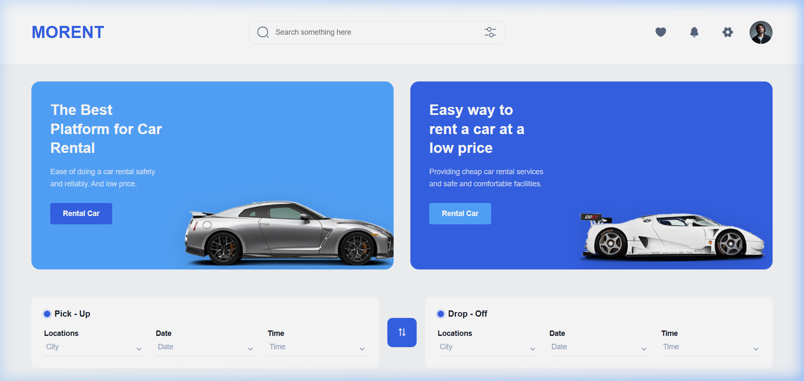
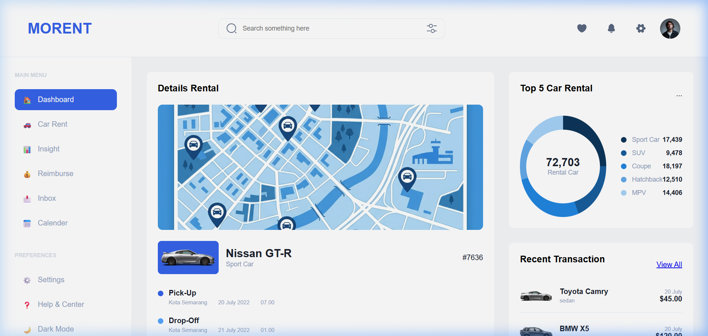
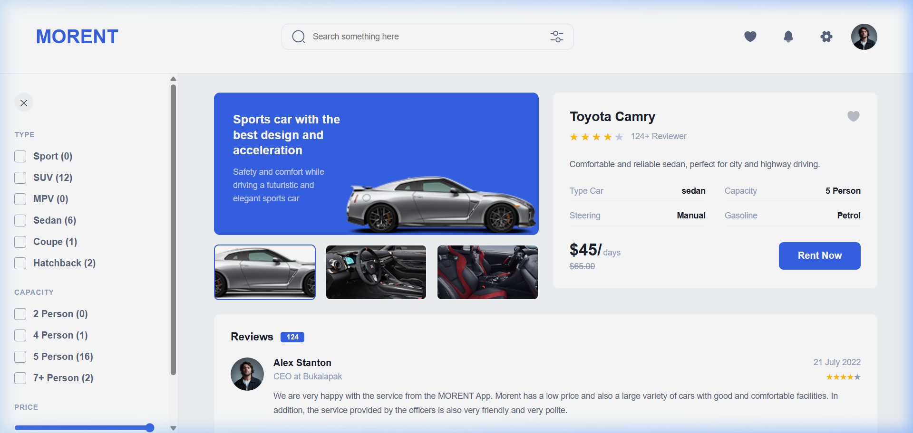

# 🚗 Morent - Premium Car Rental Platform

Morent is a modern, high-performance car rental web application designed to provide a seamless and professional user experience. Built with React and Vite, the platform features a stunning UI/UX inspired by premium Figma designs, offering comprehensive car listing, filtering, and internal dashboard management.

---

## ✨ Key Features

- 🏎️ **Dynamic Car Listing:** View a wide range of popular and recommended cars with real-time dynamic loading.
- 🔍 **Advanced Search & Filtering:** Filter cars by type (Sport, SUV, Sedan, etc.), capacity, and price range. Includes dynamic item counts for each category.
- 📊 **Professional Dashboard:** Admin-style view to monitor rental details, location tracking (visual map), top rental stats, and recent transaction history.
- 📱 **Fully Responsive Design:** Optimized for all devices, from ultra-wide desktops to mobile phones, with a custom mobile-drawer filter system.
- 🗺️ **Rental Tracking:** Visual representation of pick-up and drop-off locations with trip details.
- ⭐ **Testimonials:** Clean and curated customer feedback section.
- 🚀 **Performance Optimized:** Fast navigation and rapid asset loading using Vite.

---

## 🛠️ Tech Stack

- **Frontend:** React.js, Vite
- **Routing:** React Router DOM
- **Styling:** Vanilla CSS (Custom design system)
- **Icons:** SVG based professional icons
- **State Management:** React Hooks (useState, useEffect, useLocation)

---

## 🚀 Getting Started

To run the project locally, follow these simple steps:

1. **Clone the repository:**
   ```bash
   git clone https://github.com/your-username/RENTAL.git
   ```

2. **Navigate to project directory:**
   ```bash
   cd RENTAL
   ```

3. **Install dependencies:**
   ```bash
   npm install
   ```

4. **Run development server:**
   ```bash
   npm run dev
   ```

---

## 📈 Future Roadmap

The project is continuously evolving. Here are the planned features for future versions:

- [ ] **Full API Integration:** Connect with a backend to fetch real-time car availability and prices.
- [ ] **Booking & Payment:** Implement a secure checkout process with payment gateway integration.
- [ ] **User Authentication:** Login and Profile management for customers.
- [ ] **Interactive Maps:** Real-time location picking and route calculation.
- [ ] **Multilingual Support:** Multi-language interface for global availability.

---

## 🖼️ Preview

| Home Page | Dashboard | Car Details |
| :---: | :---: | :---: |
|  |  |  |

---

## 📄 License

This project is open-source and available under the [MIT License](LICENSE).

---

Developed with ❤️ by [Mahammad Mammadli](https://github.com/Mr-Mammadli)
